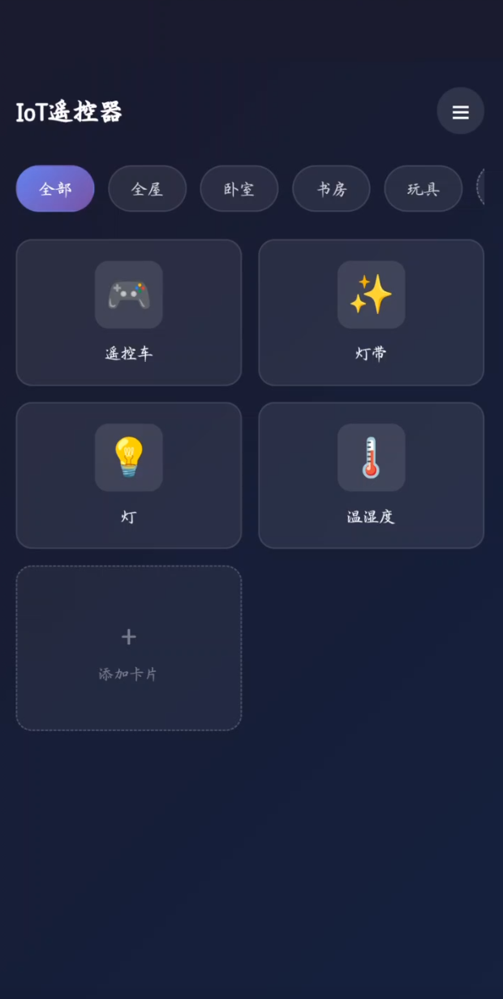
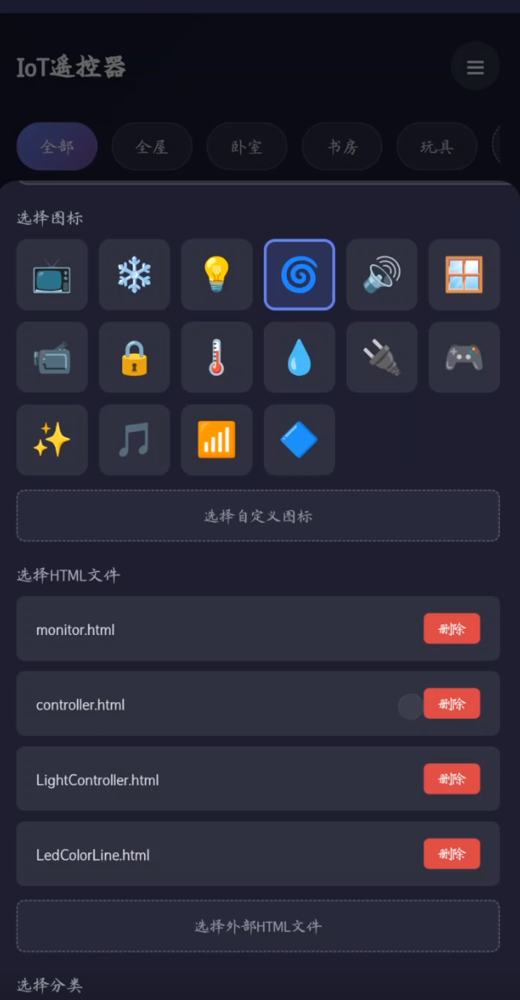

# IoT 遥控器

基于 uni-app 的物联网设备控制客户端，通过加载外部 HTML 文件实现对各类 IoT 设备的可视化控制。

## 项目路径

```
strand-iot-client/
├── pages/
│   ├── index/index.vue        # 主页：卡片管理 + 分类管理
│   └── webview/webview.vue    # WebView 页面：加载 HTML 控制界面
├── static/
│   ├── static_htmls/          # 空目录（外部文件存储位置）
│   ├── 首页.png               # 主页界面截图
│   └── 设置页面.png           # 添加卡片界面截图
├── App.vue                    # 应用根组件
├── main.js                    # 入口文件
├── pages.json                 # 页面路由配置
├── manifest.json              # 应用配置
└── uni.scss                   # 全局样式变量
```

## 页面展示

### 主页界面



### 添加卡片界面



## 核心功能

### 加载外部 HTML 控制界面

点击卡片后，应用通过 WebView 直接打开对应的 HTML 文件。支持两种 HTML 来源：

- **本地文件**：通过 `file://` 协议加载设备存储中的 HTML 文件
- **在线 URL**：通过 `http/https` 加载远程 HTML 页面

HTML 路径在 `pages/webview/webview.vue` 中统一解析，兼容 5+ App 和浏览器环境。

### 卡片管理

- 添加、编辑、删除控制卡片
- 每张卡片绑定一个外部 HTML 控制界面和图标（Emoji 或图片）
- 长按卡片触发编辑或删除操作
- 卡片数据持久化到本地存储

### 分类管理

- 支持自定义分类分组
- 卡片可归属到指定分类
- 分类横向滚动切换
- 删除分类时，其下卡片自动移至默认分类

## 技术栈

- uni-app（Vue 3）
- SCSS
- 支持 Android / iOS / H5 / 微信小程序
